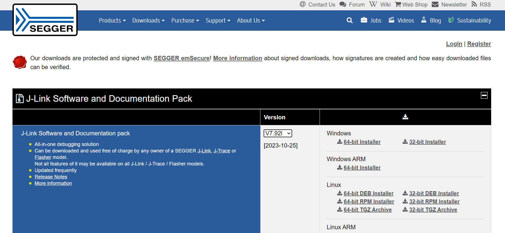
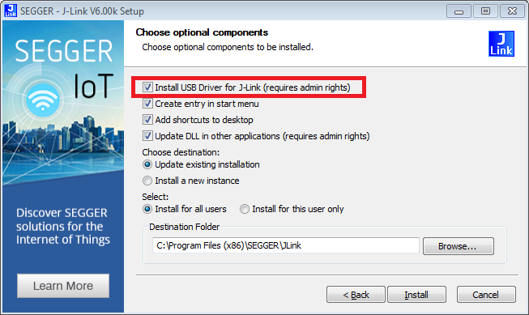
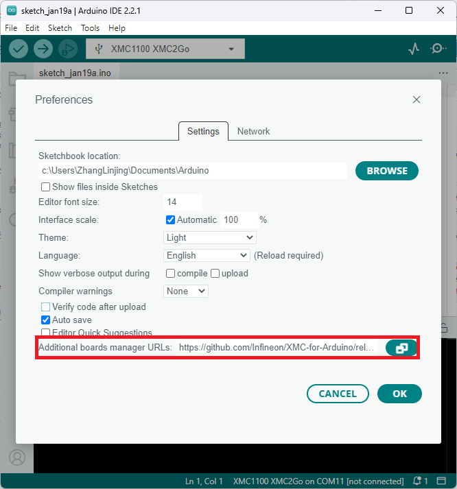

# Infineon's XMC Microcontroller Boards for Arduino

This repository integrates [Infineon's](https://www.infineon.com/) XMC microcontrollers into the [Arduino IDE](https://www.arduino.cc/en/main/software) and [PlatformIO IDE](https://platformio.org/platformio-ide?utm_source=github&utm_medium=xmc-for-arduino).

## Contents
- [Infineon's XMC Microcontroller Boards for Arduino](#infineons-xmc-microcontroller-boards-for-arduino)
  - [Contents](#contents)
  - [Supported Microcontroller Boards](#supported-microcontroller-boards)
  - [Additional Information](#additional-information)
  - [Installation Instructions](#installation-instructions)
    - [Prework for SEGGER J-Link](#prework-for-segger-j-link)
    - [Using Arduino IDE](#using-arduino-ide)
      - [Separation of release packages from version 2.0.0 onwards](#separation-of-release-packages-from-version-200-onwards)
    - [Known Issues](#known-issues)
    - [Using PlatformIO IDE](#using-platformio-ide)
  - [Contributing and Third Party Libraries](#contributing-and-third-party-libraries)
  - [Additional Contributors](#additional-contributors)

## Supported Microcontroller Boards

* [XMC1100 2Go](https://www.infineon.com/cms/en/product/evaluation-boards/kit_xmc_2go_xmc1100_v1/)
* [XMC1100 Boot Kit](https://www.infineon.com/cms/en/product/evaluation-boards/kit_xmc11_boot_001/)
* [XMC1300 Boot Kit](https://www.infineon.com/cms/de/product/evaluation-boards/kit_xmc13_boot_001/)
* [XMC1400 2Go (placeholder)]()
* [XMC1400 Kit for Arduino](https://www.infineon.com/cms/en/product/evaluation-boards/kit_xmc1400_arduino/)
* [XMC4200 Platform 2Go](https://www.infineon.com/cms/en/product/evaluation-boards/kit_xmc_plt2go_xmc4200/)
* [XMC4400 Platform 2Go](https://www.infineon.com/cms/en/product/evaluation-boards/kit_xmc_plt2go_xmc4400//)
* [XMC4700 Relax Kit](https://www.infineon.com/cms/en/product/evaluation-boards/kit_xmc47_relax_v1/)

## Additional Information

Please visit also the Wiki for additional information, e.g. datasheets, pin out diagrams, etc.:

[XMC-for-Arduino Wiki](https://github.com/Infineon/XMC-for-Arduino/wiki)

* Page for [XMC1100 XMC 2Go](https://github.com/Infineon/XMC-for-Arduino/wiki/XMC1100-2Go)
* Page for [XMC1100 Boot Kit](https://github.com/Infineon/XMC-for-Arduino/wiki/XMC1100-Boot-Kit)
* Page for [XMC1300 Boot Kit](https://github.com/Infineon/XMC-for-Arduino/wiki/XMC1300-Boot-Kit)
* Page for [XMC1400 2Go (placeholder)](https://github.com/Infineon/XMC-for-Arduino/wiki/XMC1400-2Go) 
* Page for [XMC1400 Kit for Arduino](https://github.com/Infineon/XMC-for-Arduino/wiki/XMC1400-Kit-for-Arduino)
* Page for [XMC4200 Platform 2Go](https://github.com/Infineon/XMC-for-Arduino/wiki/XMC4200-Platform2Go)
* Page for [XMC4400 Platform 2Go](https://github.com/Infineon/XMC-for-Arduino/wiki/XMC4400-Platform2Go)
* Page for [XMC4700 Relax Kit](https://github.com/Infineon/XMC-for-Arduino/wiki/XMC4700-Relax-Kit)

Additionally, please consult the [releases](https://github.com/Infineon/XMC-for-Arduino/releases) for information about the changes and new versions.

## Installation Instructions

### Prework for SEGGER J-Link

In order to use the Infineon XMC microcontrollers by this repository and program them, you need [SEGGER J-Link](https://www.segger.com/downloads/jlink) installed on your PC. Please follow this link [SEGGER J-Link](https://www.segger.com/downloads/jlink) and install the J-Link Software and Documentation Pack for your respective operating system (OS).



If you have already installed '[DAVE™ - Development Platform for XMC™ Microcontrollers](https://www.infineon.com/cms/de/product/microcontroller/32-bit-industrial-microcontroller-based-on-arm-registered-cortex-registered-m/dave-version-4-free-development-platform-for-code-generation/channel.html?channel=db3a30433580b37101359f8ee6963814)', you might skip this step as you should have the respective drivers on your system.

If you are downloading Jlink for the first time, don't forget to check the box: Install USB Driver for J-Link.




### Required tools

XMC-for-Arduino requires Python 3.x and `pyserial`. Make sure Python is installed in your machine and available in the system path.

You can check if it was successfully installed by opening your command line or terminal and typing:
```
  python --version
```
With [pip](https://pip.pypa.io/en/stable/installation/) available, install the mentioned packages from a terminal:

```
  pip install pyserial
```

### Integration in Arduino IDE
Please first download the Arduino IDE. This library only tested for Arduino IDE >=1.5, recommended to use Arduino IDE >=2.0.


Paste the following URL into the 'Additional Boards Manager URLs' input field under **File** > **Preferences** to add Infineon's microcontroller boards to the Arduino IDE.

https://github.com/Infineon/XMC-for-Arduino/releases/latest/download/package_infineon_index.json

Easier to copy (no clickable link):

```
https://github.com/Infineon/XMC-for-Arduino/releases/latest/download/package_infineon_index.json
```



To install the boards, please go now to **Tools** > **Board** > **Boards Manager...** and search for XMC. You will see options to install the board files for the microcontrollers. Click "Install" to add the boards to your Arduino IDE.


In the boards list **Tools** > **Board**, you will now find the supported XMC microcontroller boards. 


### Notes

* **The differences of the boards included in this repository if compared to the Arduino boards**
* **Refer also to the LICENSE.md/txt file of the repositories for further information**
* **The Boot Kits have limitations if compared to the official Arduino boards (consult the [XMC-for-Arduino Wiki](https://github.com/Infineon/XMC-for-Arduino/wiki) for more information)**
* **XMC-for-Arduino support for 'arm-linux-gnueabihf' only until version 1.1.**


### Release packages from version 3.0.0 onwards

Certain obsolete boards (see wiki) and non-functional libraries were removed from the board support package for the release version 2.0.0, alongwith some other major changes (see release notes). After version 3.0.0, the release index will not include library before version 2.0.0.


### Known Issues

* :warning: While using the pins connected to the **LEDs** configured as **INPUT**, there might be some abberation in behavior due to the presence of the series resistor of the LED, as it causes a voltage drop on the pin. In case of such an occurance, it is advised to desolder the series resistor and the LED and thereby using the pin as INPUT.  

### Using PlatformIO IDE 

- [What is PlatformIO?](http://docs.platformio.org/en/latest/what-is-platformio.html?utm_source=github&utm_medium=xmc-for-arduino)
- [PlatformIO IDE](http://platformio.org/platformio-ide?utm_source=github&utm_medium=xmc-for-arduino)
- [PlatformIO Core (CLI)](http://docs.platformio.org/en/latest/core.html?utm_source=github&utm_medium=xmc-for-arduino) (command line tool)
- [Integration with Cloud and Desktop IDEs](http://docs.platformio.org/en/latest/ide.html?utm_source=github&utm_medium=xmc-for-arduino) -
  Cloud9, Codeanywhere, Eclipse Che (Codenvy), Atom, CLion, Eclipse, Emacs, NetBeans, Qt Creator, Sublime Text, VIM, Visual Studio, and VSCode
- [Project Examples](https://github.com/Infineon/platformio-infineonxmc/tree/master/examples)

## Contributing and Third Party Libraries

To contribute enhancements, fixes and the like see [CONTRIBUTINGS](./CONTRIBUTING.md).

Third Party or external library maintainers see [Libraries](./Libraries.md). 
    
Also see [Wiki](https://github.com/Infineon/XMC-for-Arduino/wiki) for any additional information

## Additional Contributors

* [Paul Carpenter](https://github.com/techpaul)
