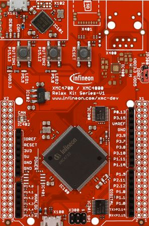

# Arduino Core for Infineon's XMC™ Microcontrollers

This project integrates Infineon's 32-bit XMC™ Industrial Arm® Cortex®-M Microcontroller into the [Arduino](https://www.arduino.cc/en/Guide/Introduction) ecosystem.

The [XMC™ microcontroller family](https://www.infineon.com/cms/de/product/microcontroller/32-bit-industrial-microcontroller-based-on-arm-cortex-m/) from Infineon is a powerful and versatile platform for embedded system development. The XMC for Arduino core provides a comprehensive set of APIs, examples, and tools for developing a wide range of applications, allowing developers to leverage the ease of use and flexibility of the Arduino platform while harnessing the advanced features and performance of the XMC™ microcontrollers.

## Supported Microcontroller Boards

<table style="text-align : center">
    <tr>
        <td></td>
        <td></td>
        <td></td>
        <td></td>
    </tr>
    <tr>
        <td><a href="https://www.infineon.com/cms/en/product/evaluation-boards/kit_xmc14_2go/?redirId=282145">KIT_XMC14_2GO</a></td>
        <td><a href="https://www.infineon.com/cms/de/product/evaluation-boards/kit_xmc11_boot_001/">KIT_XMC11_BOOT_001</a></td>
        <td><a href="https://www.infineon.com/cms/en/product/evaluation-boards/kit_xmc1400_arduino/">KIT_XMC1400_ARDUINO</a></td>
        <td><a href="https://www.infineon.com/cms/de/product/evaluation-boards/kit_xmc13_boot_001/">KIT_XMC13_BOOT_001</a></td>
    </tr>
    <tr>
        <td></td>
        <td></td>
        <td></td>
    </tr>
    <tr>
        <td><a href="https://www.infineon.com/cms/en/product/evaluation-boards/kit_xmc_plt2go_xmc4200/">KIT_XMC_PLT2GO_XMC4200</a></td>
        <td><a href="https://www.infineon.com/cms/en/product/evaluation-boards/kit_xmc_plt2go_xmc4400/">KIT_XMC_PLT2GO_XMC4400</a></td>
        <td><a href="https://www.infineon.com/cms/en/product/evaluation-boards/kit_xmc47_relax_5v_ad_v1/?redirId=114289">KIT_XMC47_RELAX</a></td>
    </tr>
</table>

More information about supported boards can be found [here](https://xmc-arduino.readthedocs.io/en/latest/hw-platforms.html).

## Getting Started

For installation & getting started instructions please refer to [our docs](https://xmc-arduino.readthedocs.io/en/latest/index.html).

## Contributing

We welcome community contributions! Please refer to our [contribution guidelines](CONTRIBUTING.md). Your help is greatly appreciated 👐

## License

See the [LICENSE](LICENSE.md) file for more details about the license.
