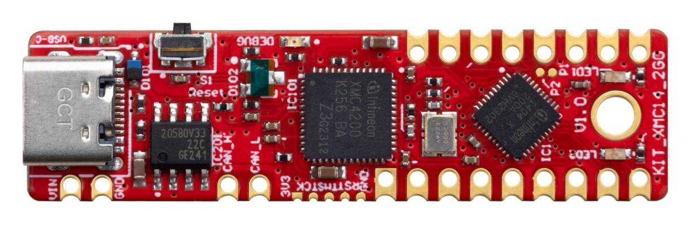

# Infineon's XMC Microcontroller Boards for Arduino

This repository integrates [Infineon's](https://www.infineon.com/) XMC microcontrollers into the [Arduino IDE](https://www.arduino.cc/en/main/software).

The [XMC microcontroller family](https://www.infineon.com/cms/de/product/microcontroller/32-bit-industrial-microcontroller-based-on-arm-cortex-m/) from Infineon is a powerful and versatile platform for embedded system development. The XMC for Arduino library provides a comprehensive set of APIs, examples, and tools for developing a wide range of applications, allowing developers to leverage the ease of use and flexibility of the Arduino platform while harnessing the advanced features and performance of the XMC microcontrollers.

## Supported Microcontroller Boards

<table>
    <tr>
        <td></td>
        <td></td>
        <td></td>
        <td></td>
        <td></td>
        <td></td>
    </tr>
    <tr>
        <td style="test-align : center"><a href="https://www.infineon.com/cms/en/product/evaluation-boards/kit_xmc14_2go/?redirId=282145">KIT_XMC14_2GO</a></td>
        <td style="test-align : center"><a href="https://www.infineon.com/cms/de/product/evaluation-boards/kit_xmc11_boot_001/">KIT_XMC11_BOOT_001</a></td>
        <td style="test-align : center"><a href="https://www.infineon.com/cms/en/product/evaluation-boards/kit_xmc1400_arduino/">KIT_XMC1400_ARDUINO</a></td>
        <td style="test-align: center"><a href="https://www.infineon.com/cms/en/product/evaluation-boards/kit_xmc_plt2go_xmc4200/">KIT_XMC_PLT2GO_XMC4200</a></td>
        <td style="test-align: center"><a href="https://www.infineon.com/cms/en/product/evaluation-boards/kit_xmc_plt2go_xmc4400/">KIT_XMC_PLT2GO_XMC4400</a></td>
        <td style="test-align : center"><a href="https://www.infineon.com/cms/en/product/evaluation-boards/kit_xmc47_relax_5v_ad_v1/?redirId=114289">KIT_XMC47_RELAX_5V_AD_V1</a></td>
    </tr>
</table>

### Library Installation

In order to get started, please visit the instalation instructions [here](https://XMC-for-Arduino.readthedocs.io/en/latest/instalation-instructions.html).

## Additional Information

More information can be found within the library [docs] (https://XMC-for-Arduino.readthedocs.io/en/latest/index.html).

## License

See the [LICENSE](LICENSE.md) file for more details about the license.