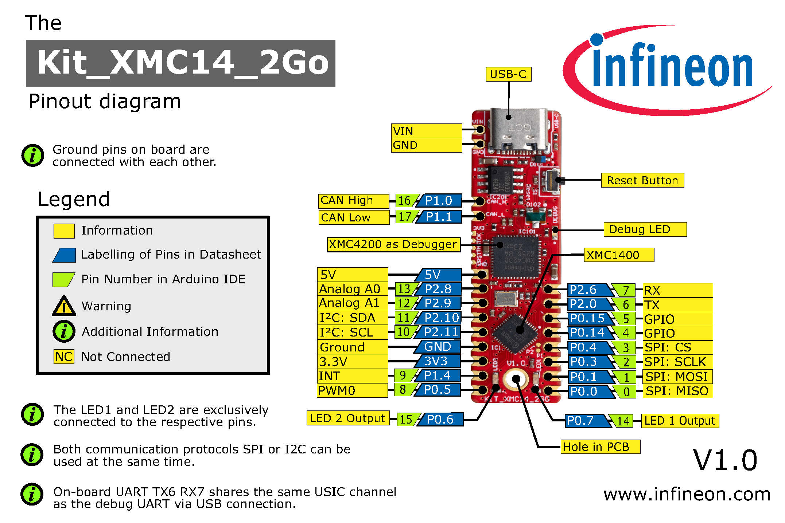

# Overview
This page summarizes information about the KIT_XMC14_2GO evaluation board and its implementation with the Arduino IDE. The board consists of a XMC1400 microcontroller with a debugger implemented by an XMC4200 microcontroller. More information about the board, including datasheets, user manuals, and schematics, can be found [here](https://www.infineon.com/cms/en/product/evaluation-boards/kit_xmc14_2go/).

# Arduino Pin Out
The pin layout of the KIT_XMC14_2GO for the Arduino IDE is as follows:

# :warning: Important Note

## CAN Terminal Resistor
The resistor R3 needs to be removed if the board is neither a start nor an end node of a CAN network.
For more information on CAN, please refer to [Built-in Libraries: CAN](Built-in-Libraries#can-library)