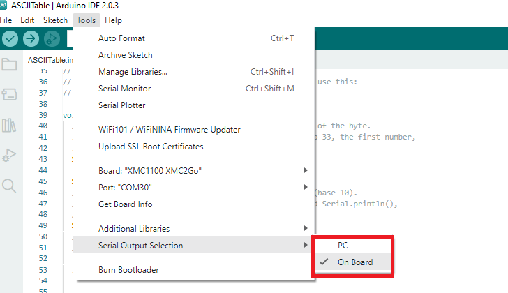

Deviations from Arduino Language Reference
==========================================

Functions and Options Differences
^^^^^^^^^^^^^^^^^^^^^^^^^^^^^^^^^

Extra modes (if patches applied)
--------------------------------

This section covers the differences between standard Arduino and XMC-for-Arduino

GPIO
++++

Extra pinMode types added that most engineers want

.. code-block:: 

    INPUT_PULLDOWN
    OUTPUT_OPENDRAIN

Extra functions (than standard Arduino AVR)
--------------------------------------------

GPIO
++++
Does what the function names says but must have been configured as output

.. code-block:: 

    digitalToggle( pin )

Arduino Function Differences
-------------------------------

Input Mode Pins
+++++++++++++++

On standard Arduino boards, GPIO is by default either a function 
like Serial or in INPUT mode.

On XMC boards the inputs are UNDEFINED, you MUST specify every pin 
to be in INPUT Mode that needs Inputs.

Wire/I2C Differences
++++++++++++++++++++

The method in Wire class for 'begin' is not the same as AVR Arduino, 
and has different modes for Master and Slave

In AVR Arduino setting an I2C Master or Slave

.. code-block:: 

     Wire.begin(8); // join i2c bus (address optional for master)

XMC-for-Arduino setting for I2C Master ONLY

.. code-block:: 

        Wire.begin(); // join i2c bus (address blank for master)

Currently the address is NOT optional for XMC as this currently assumes this
must be Slave mode configuration and sets the I2C configuration differently.

Tone
++++

Number of Tone pins is determined by pins_arduino.h define NUM_TONE_PINS. This allows for use in other modules and for variations between boards as >100MHz boards can obviously handle more tone pins.

The default for XMC1xxx is 4 with a change XMC4xxxx should be 16

Tone has frequency range of maximum = 500 Hz minimum = 1 Hz

This is due to the fact that the tone frequency is software derived from the Systick handler, Systick has a time period of 1 ms. At maximum each handler event for Systick toggles a GPIO pin, so at minimum period of 1 ms the output is toggled, so TWO events produce one square wave cycle, therefore the maximum output frequency is 500Hz.

The minimum is due to the fact that tone function only accepts an unsigned integer (32 bit) for the frequency, so the minimum usable frequency is 1.

Standard Arduino boards use hardware timers (the few that are available) to generate tones and at least one timer can interfere with other functions.

However this does mean you can have more tone pins, just much lower frequency range.

Analog Functions 
^^^^^^^^^^^^^^^^^^^^^^^^^^^^^^^^^
Resolution
--------------

Read resolution default is **10 bits (0 to 1023)**
You can set the read resolution to 8, 9, 10, 11 or 12 bits using the
:command:`analogReadResolution( bits )` function, where bits is the number of bits
you want to set the resolution to.

Write resolution default is **8 bits (0 to 255)**
You can set the write resolution to 8, 9, 10, 11, 12, 13, 14, 15 or 16 bits using the
:command:`analogWriteResolution( bits )` function, where bits is the number of bits
you want to set the resolution to.

AREF Analogue Reference
-----------------------

On all boards the Analogue Reference is set to use the internal power supply 
(however noisy), so the AREF pin is an :command:`OUTPUT` of the AREF in use. 
Do :command:`NOT` connect any external voltage source to this pin, or use 
shields that change this voltage.
This pin :command:`CANNOT` be reassigned as GPIO (pinMode has no effect).

|:warning:| :command:`CAUTION` any shorts on this pin especially to 0V (GND) will bring 
down the supply 
of the chip.

:command:`analogReference( )`

This function has only one defalut mode **DEFAULT** = 3.3V and will not match any call on parameters 
passed in with other libraries or examples that use this call. Any shields and examples that try to 
change this, will :command:`NOT` function 
the same on these boards.

DAC Analog Output
-----------------------
:command:`analogWrite( )`

This API usually Writes an analog value (PWM wave) to a pin. Some XMC4 boards have true analog output 
capabilities on the DAC enabled pins. 

The DAC output voltage range for the XMC4000 series is limited to a **minimum** of **0.3V** and a **maximum** of **2.5V**.

  .. note::

    The following example formula can be used to convert the target voltage to a digital control value (dec_target) 
    suitable for the 12-bit DAC input range:

    .. math::

      dec\_target = \frac{(V_{target} - 0.3V)}{2.5V} \times 4095

    In this formula, 0.3V is the minimum voltage, 2.5V is the maximum voltage, and 4095 is the maximum value for a 12-bit DAC. 

I2C Analog pins
^^^^^^^^^^^^^^^

Arduino Uno R3 format dictates that A4 and A5 are also used 
for I2C operations, so when I2C is enabled analogue inputs A4 
and A5 are NOT available.

On Arduino Uno R3 this is an alternate pin function, depending 
on which XMC-for-Arduino boards this could be an alternate pin 
function, or other case as described below.

.. list-table:: 
    :header-rows: 1

    * - Board
      - Functionality
      - Note
    * - KIT_XMC11_BOOT_001
      - NOT supported
      - | A4 + A5 are separate
        | A6 + A7 are alternate pin 
        | configurations to I2C
    * - KIT_XMC13_BOOT_001
      - | NOT same pin format
        | as Arduino Uno R3
      - | A10 + A11 are alternate pin
        | configurations to I2C
    * - KIT_XMC1400_ARDUINO
      - Alternate pin function
      - Matches Arduino Uno  
    * - KIT_XMC_PLT2GO_XMC4400
      - External hard wired pins
      - | For 3V3 boards set I2C pins to tristate or open drain to use
        | For 5V boards refer to [this section](https://xmc-arduino.readthedocs.io/en/latest/hw-platforms.html#connected-i2s-and-analog-pins) on track cuts to enable A4 and A5 to work
        | Level shifter on the 5V board could interfere with tristate/open drain setting
    * - KIT_XMC47_RELAX (and variants)
      - External hard wired pins
      - | For 3V3 boards set I2C pins to tristate or open drain to use
        | For 5V boards see [this section](https://xmc-arduino.readthedocs.io/en/latest/hw-platforms.html#connected-i2s-and-analog-pins) board page on track cuts to enable A4 and A5 to work
        | Level shifter on the 5V board could interfere with tristate/open drain setting

Serial selection
^^^^^^^^^^^^^^^^

Serial Output Selection
-----------------------
On the XMC boards, two kinds of serial outputs are possible, namely:

* SERIAL DEBUG (via PC)
* SERIAL ONBOARD

If these two outputs share the same instance of the internal USIC channel, 
only one of the two could be used at a given time. The selection can be made 
via the Tools menu as shown in the picture below.

This is generally the case for most of the XMC boards. However, for boards 
such as the :ref:`xmc4200-platform2go` and the :ref:`xmc4700-relax`, both the serial 
output modes are simultaneously active and neednot be selected or enabled from the menu.

Note: Please note that the sketch must be recompiled when a different serial 
output is selected.

:command:`For advanced users`
The build flag -DSERIAL_HOSTPC must be used for the serial output interface 
via PC and the build flag -DSERIAL_ONBOARD must be used for serial output 
through the onboard TX and RX pins