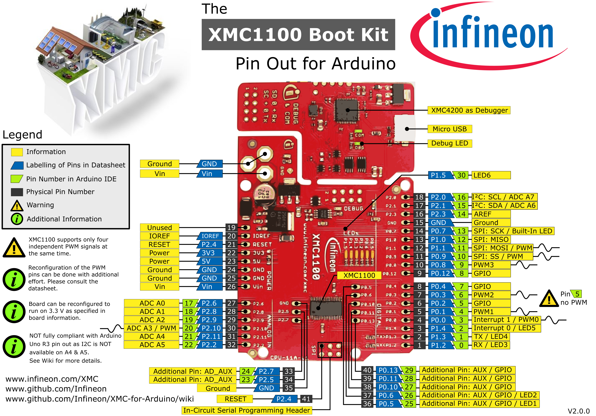
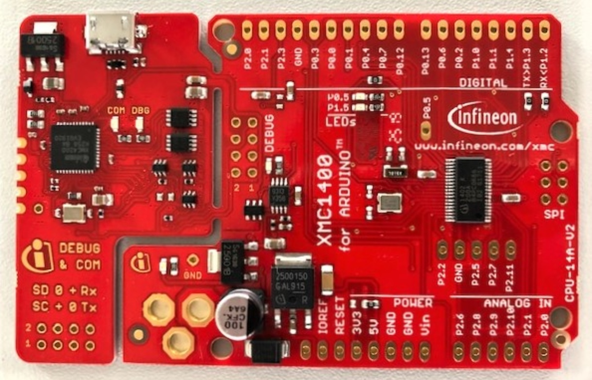
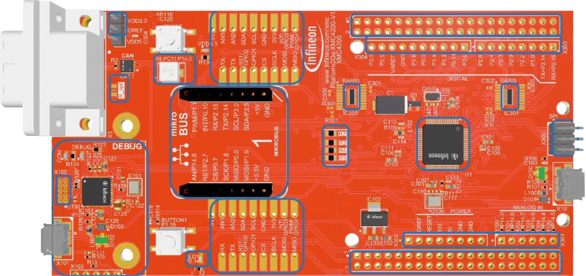
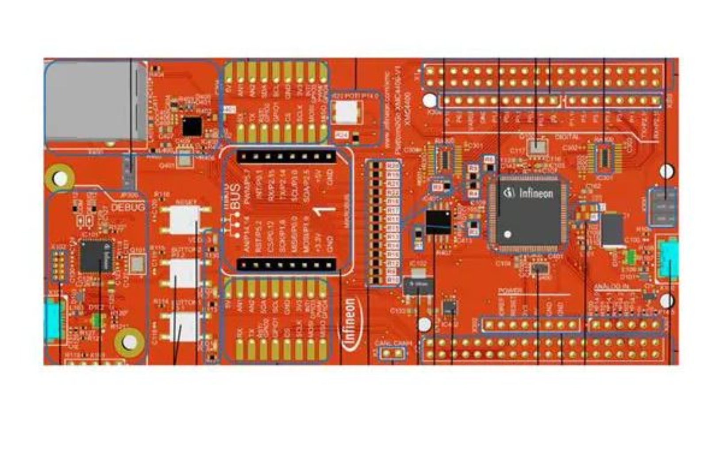
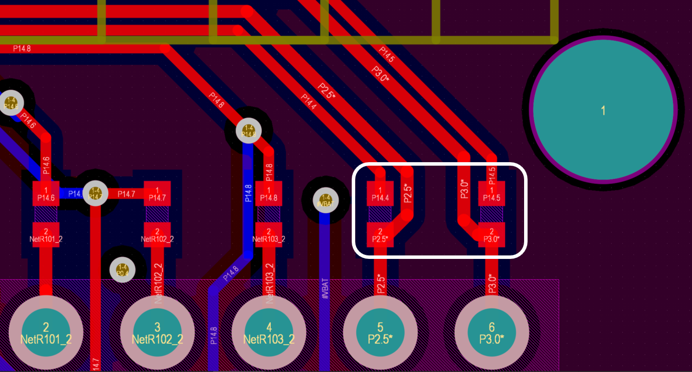
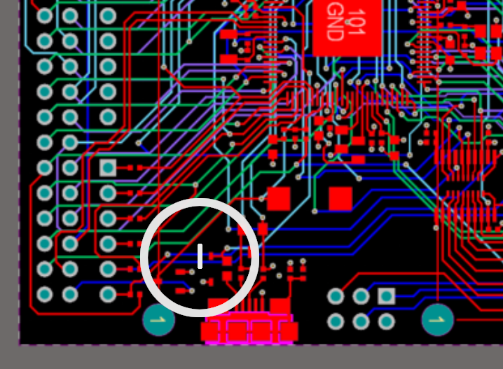
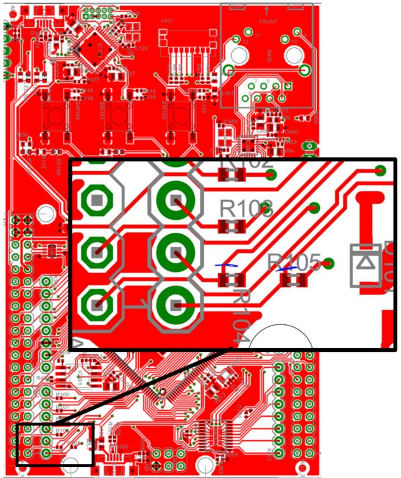

Supported Boards
=================

The following XMC microcontroller boards are supported by XMC for Arduino:

.. list-table:: Supported Microcontroller Boards
   :header-rows: 1

   * - Picture
     - Board Name
     - Description
     - Form Factor
   * - .. image:: img/KIT_XMC14_2GO.png
     - `KIT_XMC14_2GO`_
     - Kit 2Go with XMC1404 and CAN transceiver.
     - Shield2Go
   * - .. image:: img/XMC1100_Boot-Kit.jpg
     - `KIT_XMC11_BOOT_001`_
     - XMC1100 in Arduino Uno shape.
     - Arduino Uno
   * - .. image:: img/XMC1400_Arduino_Kit.jpg
     - `KIT_XMC1400_ARDUINO`_
     - XMC1400 in Arduino Uno shape.
     - Arduino Uno
   * - .. image:: img/XMC4700_Relax_Kit_5VShields.jpg
     - `KIT_XMC47_RELAX_5V_AD_V1`_
     - XMC4700 in Arduino Uno shape with lots of GPIOs.
     - Arduino Uno
   * - .. image:: img/XMC4200-Platform2go.jpg
     - `KIT_XMC_PLT2GO_XMC4200`_
     - XMC4200 compatible with multiple form-factors.
     - Arduino Uno, Shield2Go, mikroBUS
   * - .. image:: img/XMC4400-Platform2GO-Kit.jpg
     - `KIT_XMC_PLT2GO_XMC4400`_
     - XMC4400 compatible with multiple form-factors.
     - Arduino Uno, Shield2Go, mikroBUS

KIT_XMC14_2GO
-------------

.. image:: img/KIT_XMC14_2GO.png
    :width: 500

The XMC1400 Kit 2Go provides an easy way to evaluate almost all capabilities of the XMC1400 microcontroller. 
The kit is powered via USB, interfaces to other Infineon sensor boards and provides multiple interfaces including a 
CAN bus. The software development is supported via ModusToolbox™ and the Arduino IDE.  
To find out more visit the Infineon homepage of the `KIT_XMC14_2GO`_.

Pinout Diagram
^^^^^^^^^^^^^^

.. image:: img/XMC1400_Kit2Go_Pinout.svg
    :width: 600

-----------------------------------------------------------------------

KIT_XMC11_BOOT_001
------------------

.. image:: img/XMC1100_Boot-Kit.jpg
    :width: 400

The XMC1100 Boot Kit board consists of a XMC1100 microcontroller with a debugger implemented by a XMC4200 microcontroller.
The board shares the same power supply and board shape as other shields for Arduino.
To find out more visit the Infineon homepage of the `KIT_XMC11_BOOT_001`_.

Pinout Diagram
^^^^^^^^^^^^^^
Please note that Arduino pin number 16 & 22 (SCL & A5) and Arduino pin number 15 & 21 (SDA & A4) are not connected with each other 
nor share the same pins/resources. This is different from the original Arduino UNO Rev3 implementation.

-----------------------------------------------------------------------

KIT_XMC1400_ARDUINO
-------------------

The XMC1400 Kit for Arduino consists of a XMC1400 microcontroller with a debugger implemented by a XMC4200 microcontroller.
The board shares the same power supply and board shape as other shields for Arduino.
To find out more visit the Infineon homepage of the `KIT_XMC1400_ARDUINO`_.

Pinout Diagram
^^^^^^^^^^^^^^
Please note that pins P1.4 and P0.5 are swapped on the board and are not consistent with the silkscreen. As a result, interrupt 0 (INT0) 
occurs as Arduino pin 3 and inerrupt 1 (INT1) is located at Arduino pin 25. This is different from the original 
Arduino UNO Rev3 implementation. Please look at the pinout diagram above for more information.

.. image:: img/XMC1400_KitforArduino.png
    :width: 700

-----------------------------------------------------------------------

.. _xmc4200-platform2go:

KIT_XMC_PLT2GO_XMC4200
----------------------

The XMC4200 Platform 2Go evaluation board consists of a XMC4200 microcontroller with a debugger implemented by a XMC4200 microcontroller. 
To find out more visit the Infineon homepage of the `KIT_XMC_PLT2GO_XMC4200`_.
Please note that there exist versions with 5 V and 3.3V. Please be careful which version you have and use with your respective shields. 
The one described here means the 5 V version as this one is compatible with Arduino shields designed for the 5 V systems. This kit has the 
XMC4200 device with debugger plus ETHERNET, CAN, ARDUINO, MikroBUS and Shields2Go form factor. Equipped with an ARM® Cortex®-M4 based XMC™ Microcontroller 
from Infineon Technologies AG.

Pinout Diagram
^^^^^^^^^^^^^^
.. image:: img/xmc4200_platform2go.png
    :width: 700

Please note that Arduino pin number 15 & 21 (SCL & A5) and Arduino pin number 14 & 20 (SDA & A4) are connected with each other 
on the board itself. If you want to use them check out the subsection :ref:`connected_pins`.

-----------------------------------------------------------------------

KIT_XMC_PLT2GO_XMC4400
----------------------

The XMC4400 Platform 2Go evaluation board consists of a XMC4400 microcontroller with a debugger implemented by a XMC4200 microcontroller. 
To find out more visit the Infineon homepage of the `KIT_XMC_PLT2GO_XMC4400`_.
Please note that there exist versions with 5 V and 3.3V. Please be careful which version you have and use with your respective shields. 
The one described here means the 5 V version as this one is compatible with Arduino shields designed for the 5 V systems. 
This kit has the XMC4400 device with debugger plus ETHERNET, CAN, ARDUINO, MikroBUS and Shields2Go form factor. Equipped with an 
ARM® Cortex®-M4 based XMC™ Microcontroller from Infineon Technologies AG

Pinout Diagram
^^^^^^^^^^^^^^
.. image:: img/xmc4400_platform2go.png
    :width: 700

Please note that Arduino pin number 15 & 21 (SCL & A5) and Arduino pin number 14 & 20 (SDA & A4) are connected with each other 
on the board itself. If you want to use them check out the subsection :ref:`connected_pins`.

-----------------------------------------------------------------------

.. _xmc4700-relax:

KIT_XMC47_RELAX_5V_AD_V1
------------------------
.. image:: img/XMC4700_Relax_Kit_5VShields.jpg
    :width: 400

The XMC4700 Relax Kit board consists of a XMC4700 microcontroller with a debugger implemented by a XMC4200 microcontroller. 
To find out more visit the Infineon homepage of the `KIT_XMC47_RELAX_5V_AD_V1`_. 
Please note that there exist versions with 5 V and 3.3V. 
Please be careful which version you have and use with your respective shields. The one described here means the 5 V version as this one is compatible with Arduino shields designed for the 5 V systems.

Pinout Diagram
^^^^^^^^^^^^^^
.. image:: img/XMC_4700_RelaxKit_5VShields.png
    :width: 600

Please note that Arduino pin number 15 & 21 (SCL & A5) and Arduino pin number 14 & 20 (SDA & A4) are connected with each other 
on the board itself. If you want to use them check out the subsection :ref:`connected_pins`.

-----------------------------------------------------------------------

.. _connected_pins:

Connected I2S and Analog pins
-----------------------------

For the KIT_XMC_PLT2GO_XMC4200, KIT_XMC_PLT2GO_XMC4400 and KIT_XMC47_RELAX_5V_AD_V1 the Arduino pin number 15 & 21 (SCL & A5) and Arduino 
pin number 14 & 20 (SDA & A4) are connected with each other on the board itself. Although they are different physical pins of the microcontroller, 
they are connected with each other on the board to comply with the original Arduino UNO Rev3 pin connections. This influences analog measurements on 
A4 and A5 if you are using I2C simultaneously. Details of the connection can also be found in the schematics in the user manual of the board here:
`KIT_XMC_PLT2GO_XMC4200 user manual`_, `KIT_XMC_PLT2GO_XMC4400 user manual`_ and `KIT_XMC47_RELAX_5V_AD_V1 user manual`_.

The user manual shows on:

* Page 11 details the 3V3 signals on connectors X1 and X2 (figure 7) including ADC channels
* Page 12 below Figure 8 details analog input specifications

A workaround is to set the I2C pins to output open drain via pinMode(<pinNumber>, OUTPUT_OPENDRAIN); and writing a HIGH afterwards via digitalWrite(<pinNumber>, HIGH); 
to turn it off if you want to use the analog pins (but then I2C cannot be used anymore). Tri-state via pinMode(<pinNumber>, XMC_GPIO_MODE_INPUT_TRISTATE); is also possible, 
but the open drain method is preferable. These functions are using the pin mode definitions from the XMC Peripheral Library defined 
`here <https://github.com/Infineon/XMC-for-Arduino/blob/0dcbd5822cb59d12a7bdae776d307fae9c607ed7/cores/xmc_lib/XMCLib/inc/xmc4_gpio.h#L206>`_.

You can also cut the physical connection on the board itself.

For KIT_XMC_PLT2GO_XMC4200 remove the resistor R104 and R105:

For the KIT_XMC_PLT2GO_XMC4400 by cutting the marked blue routes on the back side of the PCB:

For the KIT_XMC47_RELAX_5V_AD_V1 cut the blue routes on the back side of the PCB as indicated here:

.. _KIT_XMC14_2GO: https://www.infineon.com/cms/en/product/evaluation-boards/kit_xmc14_2go/?redirId=282145
.. _KIT_XMC11_BOOT_001: https://www.infineon.com/cms/de/product/evaluation-boards/kit_xmc11_boot_001/
.. _KIT_XMC1400_ARDUINO: https://www.infineon.com/cms/en/product/evaluation-boards/kit_xmc1400_arduino/
.. _KIT_XMC_PLT2GO_XMC4200: https://www.infineon.com/cms/en/product/evaluation-boards/kit_xmc_plt2go_xmc4200/
.. _KIT_XMC_PLT2GO_XMC4400: https://www.infineon.com/cms/en/product/evaluation-boards/kit_xmc_plt2go_xmc4400/
.. _KIT_XMC47_RELAX_5V_AD_V1: https://www.infineon.com/cms/en/product/evaluation-boards/kit_xmc47_relax_5v_ad_v1/?redirId=114289
.. _KIT_XMC_PLT2GO_XMC4200 user manual: https://www.infineon.com/dgdl/Infineon-XMC4200_Platform2Go-UserManual-v01_00-EN.pdf?fileId=5546d4626f229553016f8fca76c12c96
.. _KIT_XMC_PLT2GO_XMC4400 user manual: https://www.infineon.com/dgdl/Infineon-XMC4400_Platform2Go-UserManual-v01_00-EN.pdf?fileId=5546d4626f229553016f8fc159482c94
.. _KIT_XMC47_RELAX_5V_AD_V1 user manual: https://www.infineon.com/dgdl/Infineon-Board_User_Manual_XMC4700_XMC4800_Relax_Kit_Series-UM-v01_02-EN.pdf?fileId=5546d46250cc1fdf01513f8e052d07fc
