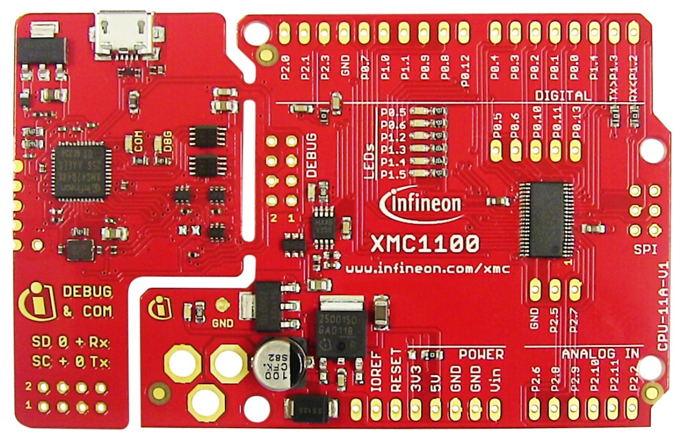

Supported Boards
================

The following XMC microcontroller boards are supported by XMC for Arduino:

.. list-table:: Supported Microcontroller Boards
   :header-rows: 1

   * - Picture
     - Board Name
     - MCU
     - Form Factor
   * - .. image:: img/KIT_XMC11_BOOT_001.jpg
     - :ref:`KIT_XMC11_BOOT_001`
     - XMC1100
     - Arduino Uno
   * - .. image:: img/KIT_XMC13_BOOT_001.jpg
     - :ref:`KIT_XMC13_BOOT_001`
     - XMC1302
     - Proprietary
   * - .. image:: img/KIT_XMC14_2GO.png
     - :ref:`KIT_XMC14_2GO`
     - XMC1404
     - Shield2Go
   * - .. image:: img/KIT_XMC1400_ARDUINO.jpg
     - :ref:`KIT_XMC1400_ARDUINO`
     - XMC1402
     - Arduino Uno
   * - .. image:: img/KIT_XMC47_RELAX.jpg
     - :ref:`KIT_XMC47_RELAX` variants
     - XMC4700
     - Arduino Uno

.. note::
    For all Kit 2Go or MS 2Go sensor boards please select ``KIT_XMC_2GO_XMC1100_V1`` in the Arduino IDE.

.. _KIT_XMC11_BOOT_001:

KIT_XMC11_BOOT_001
------------------

The `KIT_XMC11_BOOT_001 <https://www.infineon.com/cms/de/product/evaluation-boards/kit_xmc11_boot_001/>`__ board consists of a XMC1100 microcontroller with a debugger implemented by a XMC4200 microcontroller.
The board shares the same power supply and board shape as other boards for Arduino.

Pinout Diagram
^^^^^^^^^^^^^^
Please note that Arduino pin number 16 & 22 (SCL & A5) and Arduino pin number 15 & 21 (SDA & A4) are not connected with each other 
nor share the same pins/resources. This is different from the original Arduino UNO Rev3 implementation.

.. image:: img/KIT_XMC11_BOOT_001_pinout.png
    :width: 700

-----------------------------------------------------------------------

.. _KIT_XMC13_BOOT_001:

KIT_XMC13_BOOT_001
------------------

The `KIT_XMC13_BOOT_001 <https://www.infineon.com/cms/de/product/evaluation-boards/kit_xmc13_boot_001/>`__ features a XMC1302 microcontroller in TSSOP-38 with 200KB flash and detachable SEGGER J-Link.

-----------------------------------------------------------------------

.. _KIT_XMC14_2GO:

KIT_XMC14_2GO
-------------

.. image:: img/KIT_XMC14_2GO.png
    :width: 400

The `KIT_XMC14_2GO <https://www.infineon.com/cms/en/product/evaluation-boards/kit_xmc14_2go/>`__ provides an easy way to evaluate almost all capabilities of the XMC1400 microcontroller. 
The kit is powered via USB, interfaces to other Infineon sensor boards and provides multiple interfaces including a 
CAN bus. The software development is supported via ModusToolbox™ and the Arduino IDE.

Pinout Diagram
^^^^^^^^^^^^^^

.. image:: img/KIT_XMC14_2GO_pinout.svg
    :width: 700

-----------------------------------------------------------------------

.. _KIT_XMC1400_ARDUINO:

KIT_XMC1400_ARDUINO
-------------------

The `KIT_XMC1400_ARDUINO <https://www.infineon.com/cms/en/product/evaluation-boards/kit_xmc1400_arduino/>`__ consists of a XMC1400 microcontroller with a debugger implemented by a XMC4200 microcontroller.
The board shares the same power supply and board shape as other boards for Arduino.

Pinout Diagram
^^^^^^^^^^^^^^
Please note that pins ``P1.4`` and ``P0.5`` are swapped on the board and are not consistent with the silkscreen. As a result, interrupt 0 ``INT0`` 
occurs as Arduino pin ``3`` and interrupt 1 ``INT1`` is located at Arduino pin ``25``. This is different from the original 
Arduino UNO Rev3 implementation. Please look at the pinout diagram for more information.

.. image:: img/KIT_XMC1400_ARDUINO_pinout.png
    :width: 700

-----------------------------------------------------------------------

.. _KIT_XMC47_RELAX:

KIT_XMC47_RELAX
------------------------

Supported Variants
^^^^^^^^^^^^^^^^^^
* `KIT_XMC47_RELAX_V1 <https://www.infineon.com/cms/en/product/evaluation-boards/kit_xmc47_relax_v1/>`__
* `KIT_XMC47_RELAX_LITE_V1 <https://www.infineon.com/cms/en/product/evaluation-boards/kit_xmc47_relax_lite_v1/>`__
* `KIT_XMC47_RELAX_5V_AD_V1 <https://www.infineon.com/cms/en/product/evaluation-boards/kit_xmc47_relax_5v_ad_v1/>`__

.. image:: img/KIT_XMC47_RELAX.jpg
    :width: 400

The KIT_XMC47_RELAX board variants consists of a XMC4700 microcontroller with a debugger implemented by a XMC4200 microcontroller. 
Please note that there exist versions with 5V and 3.3V. 
Please be careful which version you have and use with your respective shields.
The one described here is the 5V version as this one is compatible with Arduino shields designed for 5V systems. 

Pinout Diagram
^^^^^^^^^^^^^^
.. image:: img/KIT_XMC47_RELAX_pinout.png
    :width: 700

Please note that Arduino pin number ``15`` & ``21`` (``SCL`` & ``A5``) and Arduino pin number ``14`` & ``20`` (``SDA`` & ``A4``) are connected with each other 
on the board itself. If you want to use them check out the subsection :ref:`connected_pins`.

-----------------------------------------------------------------------

.. _connected_pins:

Connected I2S and Analog pins
-----------------------------

For the ``KIT_XMC47_RELAX`` the Arduino pin number ``15`` & ``21`` (``SCL`` & ``A5``) and Arduino 
pin number ``14`` & ``20`` (``SDA`` & ``A4``) are connected with each other on the board itself. Although they are different physical pins of the microcontroller, 
they are connected with each other on the board to comply with the original Arduino UNO Rev3 pin connections. This influences analog measurements on 
``A4`` and ``A5`` if you are using I2C simultaneously. Details of the connection can also be found in the schematics in the user manual of the board here: `KIT_XMC47_RELAX user manual`_.

The user manual shows on:

* Page 11 details the 3.3V signals on connectors ``X1`` and ``X2`` (figure 7) including ADC channels
* Page 12 below figure 8 details analog input specifications

A workaround is to set the I2C pins to output open drain via ``pinMode(<pinNumber>, OUTPUT_OPENDRAIN);`` and writing a ``HIGH`` afterwards via ``digitalWrite(<pinNumber>, HIGH);`` 
to turn it off if you want to use the analog pins (but then I2C cannot be used anymore). Tri-state via ``pinMode(<pinNumber>, XMC_GPIO_MODE_INPUT_TRISTATE);`` is also possible, 
but the open drain method is preferable. These functions are using the pin mode definitions from the XMC Peripheral Library defined 
`here <https://github.com/Infineon/XMC-for-Arduino/blob/0dcbd5822cb59d12a7bdae776d307fae9c607ed7/cores/xmc_lib/XMCLib/inc/xmc4_gpio.h#L206>`_.

You can also cut the physical connection on the board itself.

For the ``KIT_XMC47_RELAX`` cut the blue routes on the back side of the PCB as indicated here:

.. image:: img/kit_xmc47_relax_cut_routes.jpg
    :width: 300

.. _KIT_XMC47_RELAX user manual: https://www.infineon.com/dgdl/Infineon-Board_User_Manual_XMC4700_XMC4800_Relax_Kit_Series-UM-v01_02-EN.pdf?fileId=5546d46250cc1fdf01513f8e052d07fc

-----------------------------------------------------------------------

Legacy Microcontroller Boards
=============================

.. list-table:: Legacy Microcontroller Boards
   :header-rows: 1

   * - Supported until
     - Board Name
     - MCU
     - Form Factor
   * - still
     - :ref:`KIT_XMC_2GO_XMC1100_V1`
     - XMC1100
     - Shield2Go
   * - v1.7.0
     - :ref:`H-BRIDGE KIT 2GO`
     - XMC1100 & IFX9201
     - Shield2Go
   * - v1.7.0
     - :ref:`XMC1300 Sense2GoL`
     - XMC1300
     - Proprietary
   * - v1.7.0
     - :ref:`XMC4700 Radar Baseboard`
     - XMC4700
     - Proprietary
   

.. _KIT_XMC_2GO_XMC1100_V1:

KIT_XMC_2GO_XMC1100_V1
----------------------

* Replaced by :ref:`KIT_XMC14_2GO`

The XMC1100 2Go board consists of a XMC1100 microcontroller with a debugger implemented by a XMC4200 microcontroller.

Pinout Diagram
^^^^^^^^^^^^^^

.. image:: img/KIT_XMC_2GO_XMC1100_V1_pinout.png
    :width: 700

-----------------------------------------------------------------------

.. _H-BRIDGE KIT 2GO:

H-BRIDGE KIT 2GO
----------------

* Name in Arduino IDE: ``XMC1100 H-Bridge 2Go``
* `Product Page <https://www.infineon.com/cms/de/product/evaluation-boards/h-bridge-kit-2go/>`__

The XMC1100 2Go board consists of a XMC1100 microcontroller with a debugger implemented by a XMC4200 microcontroller.

Pinout Diagram
^^^^^^^^^^^^^^

-----------------------------------------------------------------------

.. _XMC1300 Sense2GoL:

XMC1300 Sense2GoL
-----------------

* Name in Arduino IDE: ``XMC1300 Sense2GoL``

24 GHz sensor development kit utilizing Infineon BGT24LTR11 RF transceiver
and XMC1300 32-bit ARM® Cortex®-M0 MCU series.

-----------------------------------------------------------------------

.. _XMC4700 Radar Baseboard:

XMC4700 Radar Baseboard
-----------------------

* Name in Arduino IDE: ``XMC4700 Radar Baseboard``
* `Product Page <https://www.infineon.com/cms/en/product/evaluation-boards/demo-sense2gol-pulse/>`__

The Sense2GoL Pulse radar system is a demo platform for Infineon's 24GHz BGT24LTR11 radar transceiver.
The Sense2GoL Pulse consists of two boards – the microcontroller board with the XMC4700 (RADAR BB XMC4700)
and a radar frontend board (BGT24LTR11 Shield), which features a 4x1 array antenna for the transmitter and
receiver sections. It is shielded with a metal cover and absorber material to get the best RF performance.

Pinout Diagram
^^^^^^^^^^^^^^

