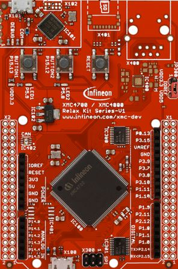

****************
XMC for Arduino
****************
Welcome to the Infineon's XMC Microcontroller Boards for Arduino!

.. image:: img/KIT_XMC14_2GO.png
    :width: 200

.. image:: img/XMC1100_Boot-Kit.jpg
    :width: 200

The XMC microcontroller family from Infineon is a powerful and versatile platform for embedded system development. 
With its high-performance architecture, advanced peripherals, and low power consumption, XMC microcontrollers are an ideal 
choice for a wide range of applications.

The XMC for Arduino library is a powerful and flexible software framework that enables developers to harness the full 
potential of the XMC microcontrollers using the popular Arduino ecosystem. This library provides a comprehensive set of APIs, 
examples, and tools that allow developers to quickly and easily develop and deploy a wide range of applications, from simple 
prototypes to complex systems. Key features include:

* A comprehensive set of APIs for accessing and controlling the XMC microcontroller's peripherals, such as GPIO, UART, SPI, I2C, and more
* Support for a wide range of sensors and actuators, including analog and digital sensors, displays, and communication modules
* Advanced features like interrupt handling, DMA, and power management
* Compatibility with a wide range of  Arduino boards and shields
* Examples and tutorials to help developers get started quickly and easily

With the XMC for Arduino library, developers can leverage the ease of use and flexibility of the Arduino platform while harnessing 
the advanced features and performance of the XMC microcontrollers.

.. toctree::
   :maxdepth: 2
   :caption: CONTENT:

   Introduction<self>
   installation-instructions
   hw-platforms
   buildin-libraries
   library-details

License
=======

Please find the license file for this library `here <https://github.com/Infineon/XMC-for-Arduino/blob/master/LICENSE.md>`_.

