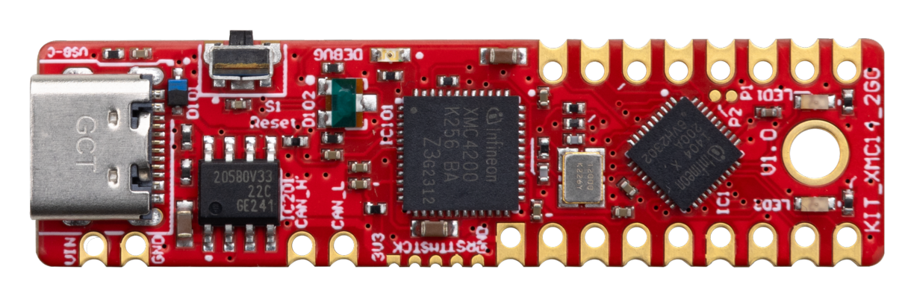

***************
XMC for Arduino
***************
Welcome to Infineon's XMC Microcontroller Boards for Arduino!

.. image:: img/KIT_XMC11_BOOT_001.jpg
    :width: 200

.. image:: img/KIT_XMC47_RELAX.jpg
    :width: 200

The XMC microcontroller family from Infineon offers a powerful and versatile platform for embedded system development. 
Featuring a high-performance architecture, advanced peripherals, and low power consumption, XMC microcontrollers are 
well-suited for a broad range of applications.

The XMC for Arduino core provides a flexible software framework enabling developers to fully utilize the capabilities 
of XMC microcontrollers within the popular Arduino ecosystem. This library includes an extensive set of APIs, examples, 
and tools, facilitating the rapid development and deployment of various applications, from simple prototypes to intricate systems. 
Key features include:

* A rich set of APIs for accessing and controlling peripherals such as GPIO, UART, SPI, I2C, and more.
* Support for numerous sensors and actuators, including both analog and digital sensors, displays, and communication modules.
* Advanced features like interrupt handling, DMA, and power management.
* Compatibility with a wide range of Arduino boards and shields.
* Numerous examples and tutorials to help developers get started quickly and efficiently.

By using the XMC for Arduino core, developers can enjoy the ease of use and flexibility of the Arduino platform while taking 
advantage of the advanced features and performance offered by XMC microcontrollers.

.. toctree::
   :maxdepth: 2
   :caption: CONTENT:

   Introduction<self>
   installation-instructions
   development-instructions
   hw-platforms
   builtin-libraries
   arduino-deviations

License
=======

Please find the license file for this core `here <https://github.com/Infineon/XMC-for-Arduino/blob/master/LICENSE.md>`_.