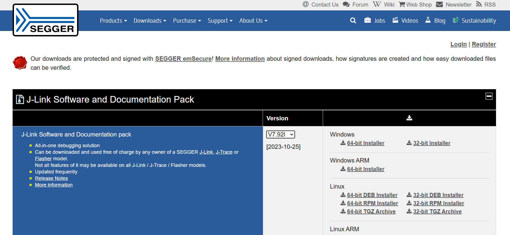
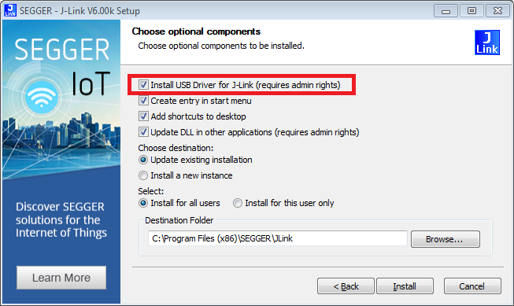
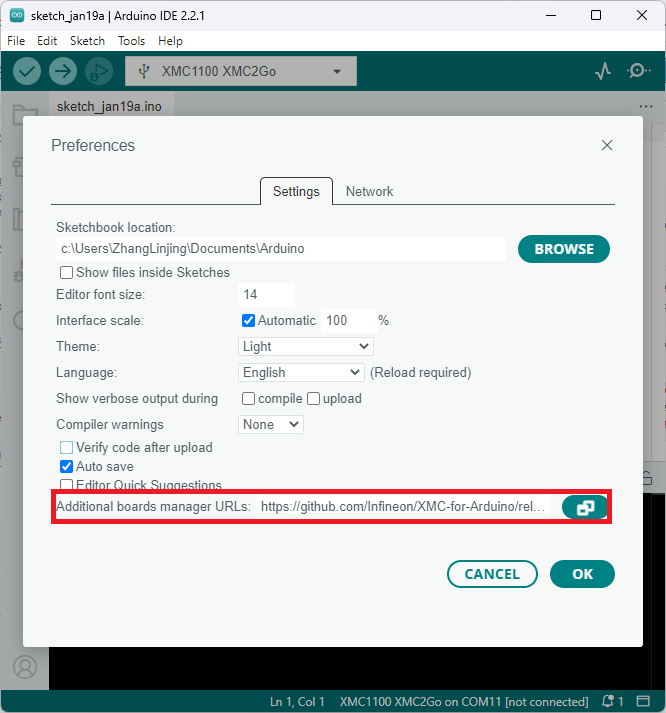
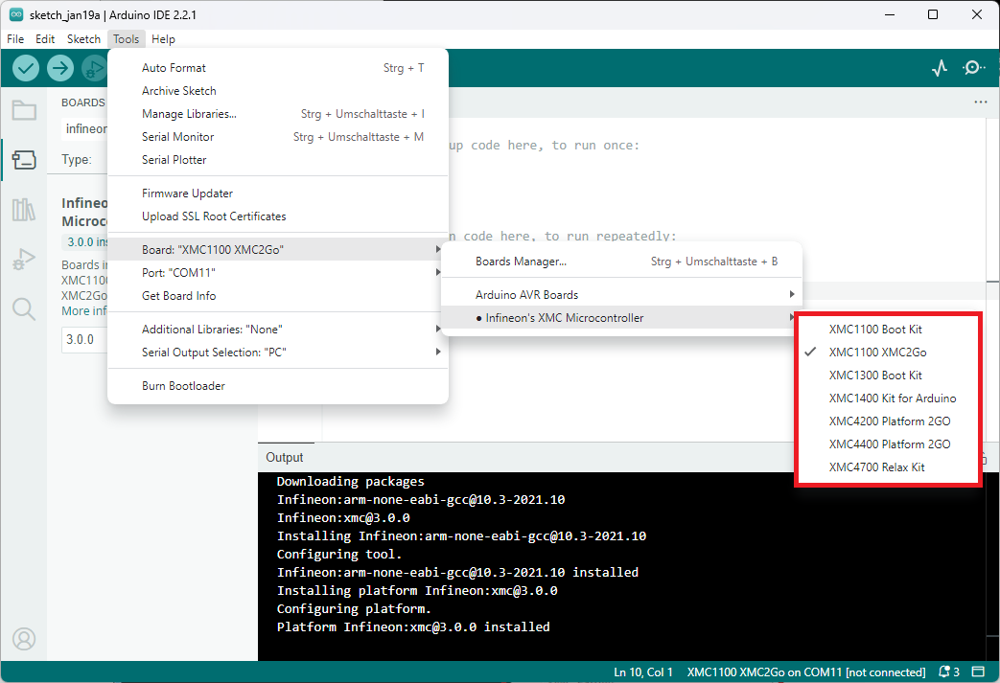
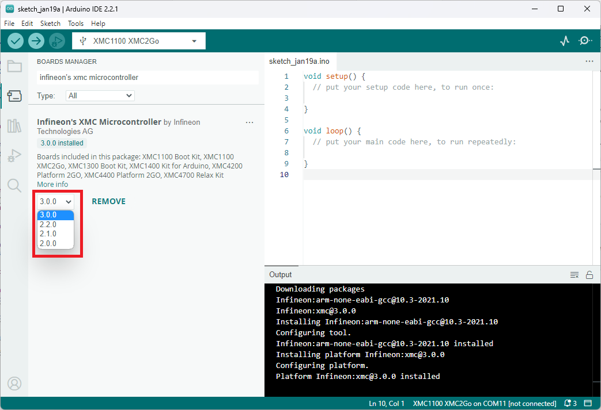

Installation Instructions
===========================

The following step-by-step guide will get you started with XMC for Arduino:

Prework for SEGGER J-Link
------------------------------

In order to use Infineon's XMC microcontroller boards in Arduino you need
`SEGGER J-Link <https://www.segger.com/downloads/jlink>`_ installed on your machine first. Please follow
`this link <https://www.segger.com/downloads/jlink>`_ 
and install the *J-Link Software and Documentation Pack* for your respective operating system.

If you are downloading J-Link for the first time, make sure to check the box **Install USB Driver for J-Link**.

Required Tools
^^^^^^^^^^^^^^
XMC for Arduino requires *Python 3.x* and *pyserial*. Make sure `Python <https://www.python.org/>` is installed on your machine and available in the system path.

You can check if it was successfully installed by opening your command line or terminal and typing:

.. code-block:: shell

  python --version
 
With `pip <https://pip.pypa.io/en/stable/installation/>`_ available, install the mentioned packages from a terminal:

.. code-block:: shell

  pip install pyserial
 
Integration in Arduino IDE
--------------------------
.. note::
    We recommended to use Arduino IDE 2.0 or higher.

.. image:: img/preference.png
    :width: 600

Paste the following URL into the *Additional boards manager URLs* input field under *File > Preferences* to add Infineon's XMC microcontroller boards to the Arduino IDE:

::

    https://github.com/Infineon/XMC-for-Arduino/releases/latest/download/package_infineon_index.json

To install the boards, navigate to *Tools > Board > Boards Manager...* and search for *XMC*. You will see options to install the board files for the microcontrollers. 
Click *Install* to add the boards to your Arduino IDE.

.. image:: img/Boards_Manager_Entry.png
    :width: 600

In the boards list *Tools > Board*, you will now find the supported XMC microcontroller boards.

Release Packages from Version 3.0.0 onwards
^^^^^^^^^^^^^^^^^^^^^^^^^^^^^^^^^^^^^^^^^^^
Certain obsolete boards and non-functional libraries were removed from the board support package for the 
release version 2.0.0, alongwith some other major changes (see `release notes<https://github.com/Infineon/XMC-for-Arduino/releases/tag/V2.0.0>`). After version 3.0.0, the release index 
will not include releases before version 2.0.0.

